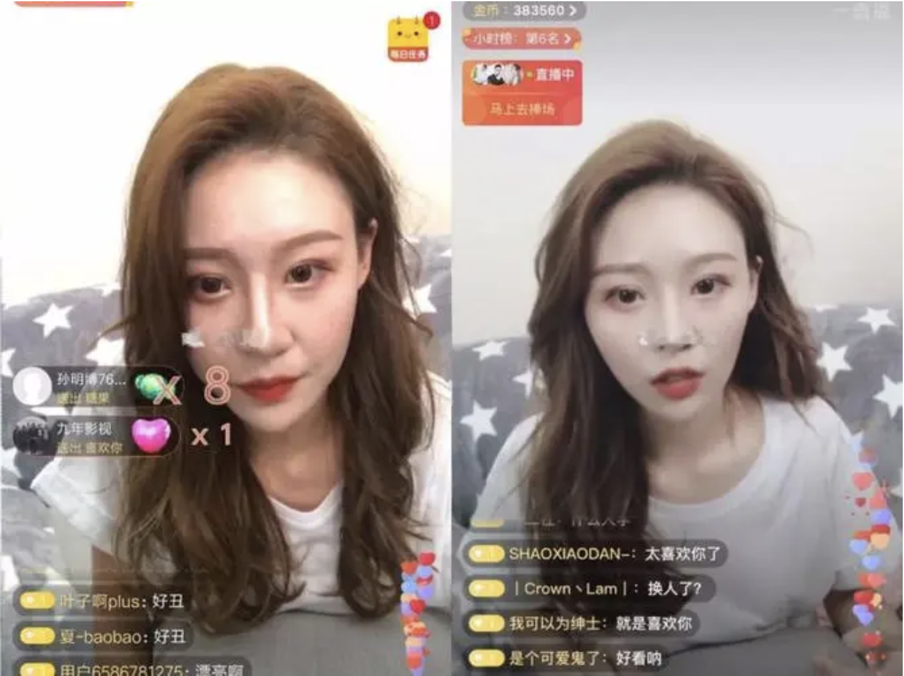
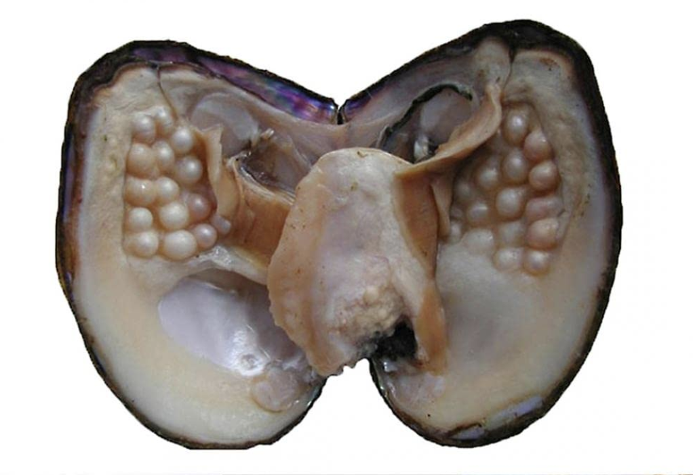
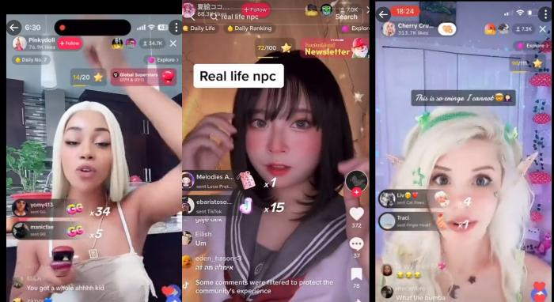

# the e-girl's guide to metabolism

## 1. metabolising as membrane-making
> "in order to qualify as an autopoietic entity, that is, as an individual
> organism, any such material-metabolising entities must be bounded by membranes
> made by their own metabolism. biologically, any individual is minimally a
> metabolic system [...] bounded by a single, continuous covering. the breaching
> of this boundary signals disintegration or loss of autopoietic status."

*"The Uncut Self" (1997), Dorion Sagan & Lynn Margulis*

the beauty filter on TikTok, Douyin, and similar streaming platforms is a self-
metabolised membrane for our digital organism -- and for the streamer watching
herself in the selfie camera, increasingly a second skin for her actual self.
she metabolises toxic beauty standards and consumer culture into a new membrane.
glitches on the platform can cause the filter to temporarily shut off,
constituting a breach of the membrane.

*a Douyin streamer whose filter was accidentally shut off*

## 2. metabolising as work ethic
bacteria breaking down plastic, Kim Kardashian upselling concrete, pearls and
ambergris -- the more toxic the raw material, the more crucial our ability to
digest it and profit from it:
- grow cysts and pop them in ASMR videos;
- put acid peels on your feet and stream the dead skin coming off like a glove;
- take a pill by [Equator Therapeutics](https://equatortherapeutics.com/) to
  increase metabolism and lose weight. (metabolism is a moral choice!)

*pearls are just oyster cysts*

## 3. metabolising the self / being metabolised
"prompt engineers" can already make upwards of 400k a year -- the final act of
the metaboliser is to be metabolised, bimbofied, dissolved, broken down into
her component metabolic parts.

> "Critters interpenetrate one another, loop around and through one another,
> eat each other, get indigestion, and partially digest and partially assimilate
> one another, and thereby establish sympoietic arrangements that are otherwise
> known as cells, organisms, and ecological assemblages."

*"Staying with the Trouble" (2016), Donna Haraway*

> "... they are simply regurgitating total information, as if they’re role-playing
> early chatbots run on dirty data sets, like Microsoft’s swiftly lobotomized Tay.
> [...] users role-play as bots in order to “[feign] a sense of machine-induced
> objectivity and randomness, hence escaping the liabilities of and political
> consequences that would be activated by a concession of human agency.”"

*"Everyone is a Girl Online" (2023), Alex Quicho, WIRED*

*girls role-playing as NPCs on TikTok*

## 4. resources
- ["The Uncut Self" (1997), Dorion Sagan & Lynn Margulis](./the_uncut_self.pdf)
- ["Everyone is a Girl Online" (2023), Alex Quicho, WIRED](https://archive.is/WGBnA)
- ["The World Is Toxic. Welcome to the Metabolic Era" (2023), Kelly Pendergrast, WIRED](https://archive.is/mbGfP)
- ["Ghost in the Cloud" (2017), Meghan O'Gieblyn](https://www.nplusonemag.com/issue-28/essays/ghost-in-the-cloud/)